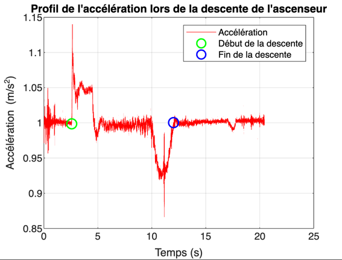

Ce présent dossier contient les deux simulations du G5E pour l'Etat de l’Art à propos des Accéléromètres Industriels (MEMS et autres)

## Simulation 1

Construction d’un dispositif pour mesurer l’accélération linéaire à l’aide d’un
accéléromètre. Pour cette simulation, nous pouvons utiliser un accéléromètre
MEMS. 

Dans le cas de l’utilisation de ce capteur, nous avons utilisé un smartphone pour enregistrer les données de l’accéléromètre.

Nous sommes monté dans un ascenseur pour effectuer des mesures d’accélération linéaire lors de la montée de celui-ci à l'aide d'une application sur smartphone.

Nous avons utilisé un logiciel de traitement de données (MATLAB) et un code python équivalent pour analyser les données et déterminer la vitesse de l’ascenseur au cours
du temps. Nous avons tracé un graphique de l'accélération en fonction du temps pour visualiser les résultats.

#### Nous avons obtenu les résultats suivants :

```

L'accélération est positive de 2.57 s à 4.62 s avec une accélération moyenne de 0.47 m/s^2
L'accélération est negative de 10.04 s à 12.00 s avec une deceleration moyenne de -0.49 m/s^2

On en déduit une accélération pendant 1.96 m à une vitesse de 0.95 m/s
On en déduit une deceleration pendant 1.89 m à une vitesse de 0.96 m/s

La distance parcourue entre l'accélération et la décélération est calculée par x(t)=v1*t+x0
Elle est de 5.17 m

Ce qui fait un total de 9.02 m en 9.43 s

```
#### Nous obtenons ce graphique :




